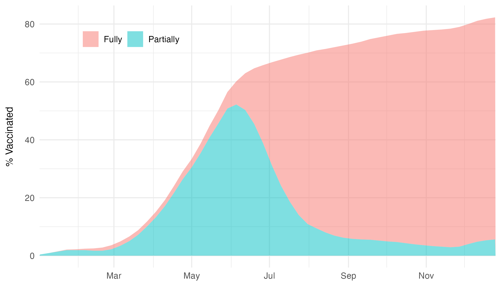

<br>
<br>

# 1. Setup
The data is downloaded from the Canadian government website and is publically available [here](https://open.canada.ca/data/en/dataset/261c32ab-4cfd-4f81-9dea-7b64065690dc) 
```{r pkg, warning = FALSE, message =F}
knitr::opts_chunk$set(warning = FALSE, message = FALSE)

# Installing packages
library(knitr)
library(tidyverse)
library(RColorBrewer)
library(ggpubr)
library(mapcan)
library(patchwork)

# setwd('~/Desktop/Coding/web/personal_site/r/covid_analysis/')


# Data: https://open.canada.ca/data/en/dataset/261c32ab-4cfd-4f81-9dea-7b64065690dc
cov <- read_csv("./data/covid19-canada.csv")
vax <- read_csv('./data/vaccination.csv')

```

# 2. Creating plots

## i. Infections by VOC
```{r inf}

# Infections
voc_plot <-
  cov %>%  
  as_tibble() %>% 
  select(prov = prname, date, cases = avgcases_last7) %>% 
  filter(prov != 'Canada') %>% 
  mutate(prov = case_when(prov == 'Alberta' ~ 'Alberta', 
                          prov == 'Ontario' ~ 'Ontario', 
                          prov == 'British Columbia' ~ 'British Columbia', 
                          prov == 'Quebec' ~ 'Quebec', 
                          TRUE ~ 'Rest of Canada')) %>% 
  group_by(date, prov) %>% 
  summarise(cases = sum(cases)) %>% 
  ungroup() %>% 
  filter(date >= '2021-01-01' & date <= '2021-12-31') %>% 
  ggplot(aes(x = date, y = cases, color = prov)) + 
  geom_line(size = 1) + 
  theme_minimal() + 
  labs(x = NULL, 
       y = 'Infections',
       color = NULL,
       title = NULL) + 
  theme(plot.title = element_text(hjust = 0.5),
        legend.position = "top", 
        axis.title.y = element_text(size = 10, 
                                    margin = margin(r = 10))) + 
  scale_color_brewer(palette="Set1") + 
  scale_x_date(breaks = "2 month", date_labels = "%b",
               minor_breaks = '1 month',
               expand = c(0, 0))


ggsave( "output/infections.png", width = 7, height = 4, , bg = "white")

```
```{r img-inf, fig.cap="Figure 1. Infections by province during 2021"}
 
```


## ii. Timeline of variant
```{r voc}

# VOCs
timeline_plot <-
  tibble(period = c('n', 'ag', 'd', 'o'), 
         labels = c('Non-VoCs', 'Alpha & Gamma', 'Omicron', 'Delta'),
         start = as.Date(c('2021-01-01', '2021-03-15', '2021-11-02', '2021-05-01')),
         end = as.Date(c('2021-04-20', '2021-06-15', '2021-12-31', '2021-12-15')),
         height = c(400, 300, 100, 200),
         date_lab = c('Jan - Apr', 'Mar - Jun', 'Nov - Dec', 'May - Dec'),
         max = as.Date(c('2021-04-20', '2021-06-15', '2021-09-25', '2021-03-20'))
  ) %>% 
  mutate(period  = factor(period, levels = c('n', 'ag', 'd','o'))) %>%  
  pivot_longer(cols = start:end, 
               names_to = 'time', 
               values_to = 'date') %>% 
  group_by(period) %>% 
  mutate(mean = mean(date)) %>% 
  ungroup() %>% 
  ggplot(aes(x = date, y = height, color = period)) + 
  geom_line(size = 6) + 
  geom_text(aes( x = mean, y = height + 7, label = labels), color = 'white', size = 3) + 
  geom_text(aes( x = max + 2, y = height + 7, label = date_lab), color = 'darkgrey', size = 3, hjust = 0) + 
  scale_color_manual(labels =  c('Non-VOC vs. Alpha/Gamma', 'Alpha vs. Gamma', 'Delta vs. Omicron'),
                     values = c("#D16103", "#52854C", "#4E84C4", "darkblue")) +
  ylim(50, 450) + 
  labs(x = NULL, y = "Prevalent variants", color = NULL) + 
  theme_minimal() + 
  theme(legend.position = "none", 
        plot.title = element_text(hjust = 0.5),
        axis.title.y= element_text(color = 'black', size = 10, margin = margin(r  = 10)),
        axis.text.y = element_text(color = 'white'),
        panel.grid.major.y = element_blank(),
        panel.grid.minor.y =element_blank()) +
  scale_x_date(breaks = "2 month", date_labels = "%b",
               minor_breaks = '1 month',
               expand = c(0, 0))

ggsave( "output/timeline.png", width = 7, height = 1.5, , bg = "white")

```

```{r img-voc, fig.cap="Figure 2. Variants waves over 2021"}
 
```

## iii. Mortality rates
The section below uses the package `canmap` to plot the map of rates by province
```{r map}
# Map
pr_geographic <- mapcan(boundaries = province,
                        type = standard)


rates <-
  cov %>% 
  select(pr_english = prname, date, rate = ratedeaths_last14) %>% 
  filter(pr_english !='Canada') %>% 
  filter(pr_english != 'Repatriated travellers') %>% 
  droplevels() %>% 
  group_by(pr_english) %>% 
  summarise(rate = mean(rate, na.rm=T)) 


rates_join <- left_join(pr_geographic, rates, by = 'pr_english')


map <-
rates_join %>%
  ggplot(aes(x = long, y = lat, group = group, fill = rate)) +
  geom_polygon() +
  coord_fixed() +
  theme_mapcan() + 
  scale_fill_viridis_c(name = "Mortality rate / 100K") +
  guides(fill = guide_colourbar(title.position = "top")) + 
  theme(legend.position = c(0.7, 0.75),
        legend.direction="horizontal",
        legend.title = element_text(size = 9))


ggsave( "output/mortality.png", width = 6, height = 6, , bg = "white")

```

```{r img-motrality, fig.cap="Figure 3. Map of mortality rates"}
knitr::include_graphics("output/mortality.png") 
```


## iv. Vaccination
```{r vax}
# Vaccination
vax_plot <- 
vax %>% 
  select(prov = prename, Partially = proptotal_partially, 
         Fully = proptotal_fully, date = week_end) %>% 
  filter(prov ==  'Canada') %>% 
  mutate(Fully = as.numeric(ifelse(Fully == '<0.1', 0, Fully))) %>% 
  filter(date >= '2021-01-01' & date <= '2021-12-31')  %>% 
  pivot_longer(c(Partially, Fully), names_to = 'vax', values_to = 'prop') %>% 
  ggplot(aes(x=date, y = prop, fill = vax)) +
    geom_area(alpha = 0.5) + 
    theme_minimal() + 
    labs(x = NULL, 
         y = '% Vaccinated',
         fill = NULL,
         title = NULL) + 
    theme(plot.title = element_text(hjust = 0.5),
          axis.title.y= element_text(color = 'black', size = 10, margin = margin(r  = 10)),
          legend.position = c(0.2, 0.88),
          legend.direction="horizontal",
          legend.title = element_text(size = 9)) +
    scale_x_date(breaks = "2 month", date_labels = "%b",
                 minor_breaks = '1 month',
                 expand = c(0, 0)) +
      guides(fill = guide_legend(title.position = "top")) 


ggsave( "output/vaccination.png", width = 7, height = 4, , bg = "white")

  
```

```{r img-vax, fig.cap="Figure 4. Proportion of vaccinated"}
 
```

# 3. Final plot 
The final plot will take all the plots created above and use `patchwork` to combine them into a publication-ready figure. 
```{r combined}

combined <- 
((voc_plot / vax_plot / timeline_plot) | map ) + 
  plot_annotation(title = 'The COVID-19 pandemic at a glance', 
                  subtitle = "Canada, 2021", 
                  tag_levels = 'A')  & 
  theme(plot.title = element_text(size = 15, hjust = 0.5),
        plot.subtitle = element_text(size = 12, hjust = 0.5),
    plot.tag = element_text(size = 8))

# ggsave( "../../images/epi-plot-full.png", width = 13, height = 6.5, , bg = "white")

```

```{r img-combined, fig.cap="Figure 5. Final combined plots"}
knitr::include_graphics("../../images/epi-plot-full.png") 
```


