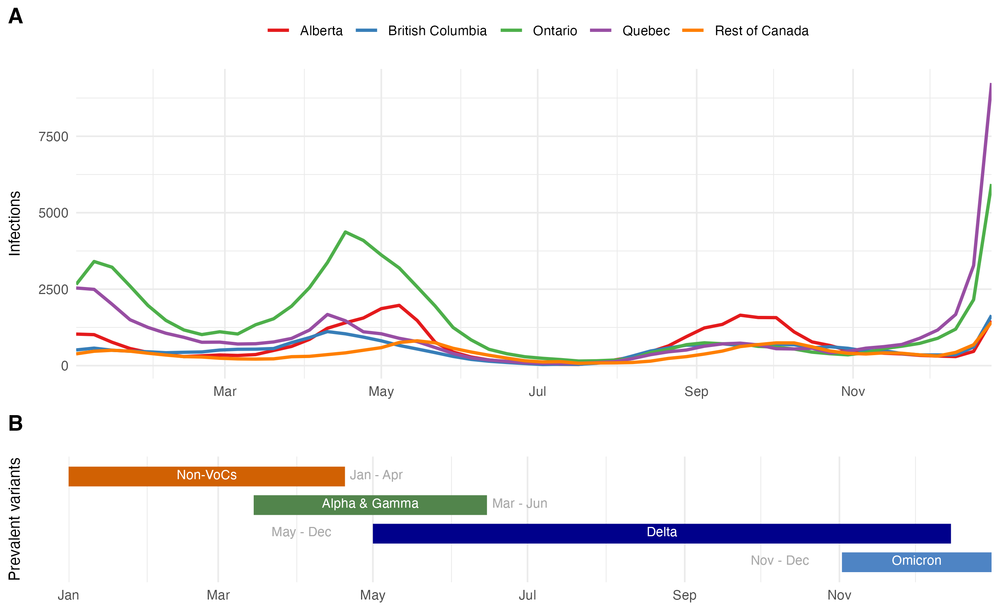
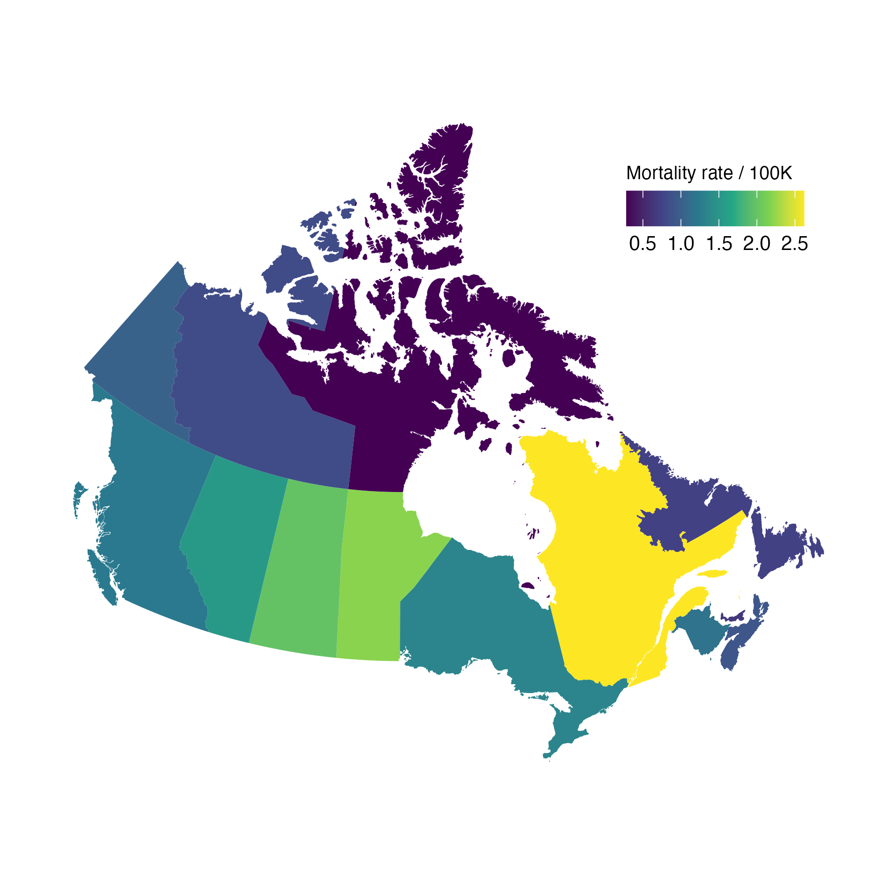
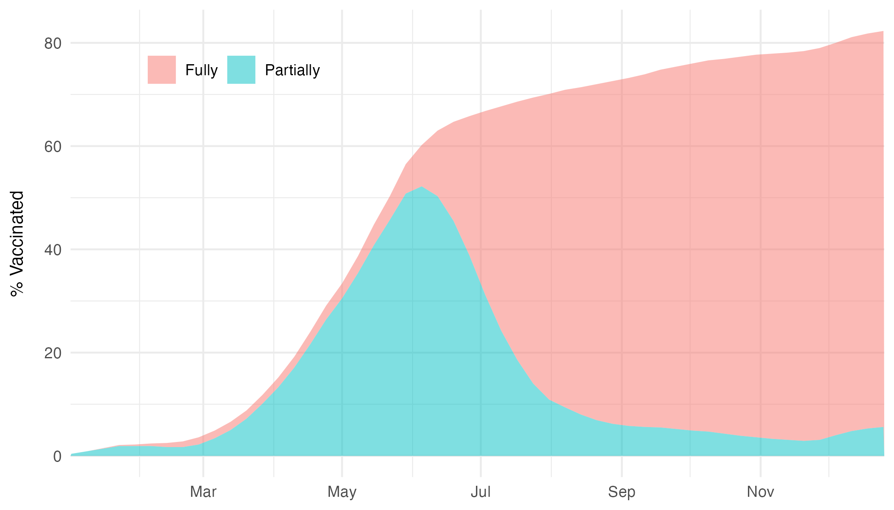

<br>
<hr>
<br>
```{r setup, include=FALSE}
knitr::opts_chunk$set(echo = FALSE, warning = FALSE, message = FALSE)
```

# Background 
The first cases of COVID-19, an infection caused by SARS-CoV-2, was first discovered in 2019, and quickly spread across the globe. Since the beginning of the pandemic, COVID-19 has stressed healthcare systems, leading to the implementation of various public health measures and vaccination programs. In 2021, researchers and clinicians began to discover increased rates of infeection and mortality being caused by specific strains of COVID-19. These variants, named variants of concern (VOCs), include Alpha, Beta, Gamma, Delta and Omicron. 
<br>
<br>
This report will use publically available data downloaded from the government of Canada website to better understand key trends of COVID-19 during 2021. In doing so, this report will create informative tables and figures for infections, mortality, and vaccination by province.

<br>
<hr>
<br>

# Methods 

## Data 
The data used in this analysis is publicly available and can be found at the Canadian Government [webiste](https://open.canada.ca/data/en/dataset/261c32ab-4cfd-4f81-9dea-7b64065690dc). This report uses data from 2021, which was a key point in the pandemic with the introduction of variants of concern (VOC) and the COVID-19 vaccines. The report takes the data stratified by province. The variables of interest were infections, mortality and vaccination. 

## Analysis
This report was conducted using `r` and `rmarkdown` using packages from the `tidyverse` for data cleaning and wrangling, `ggplot2` for creating figures and `mapcan` for creating the chloropleth map. Descriptive characteristics of each metric, stratified by province.
<br> <br>
This analysis will conduct three primary sub-analyses: i) infections by province over time; ii) mortality rate over the year, plotted over a map of Canada; and iii) percentage of vaccinated (partially and fully). 

<br>
<hr>
<br>

# Results
```{r pkg, warning = FALSE, message =F}
knitr::opts_chunk$set(warning = FALSE, message = FALSE)

# Installing packages
library(knitr)
library(tidyverse)
library(RColorBrewer)
library(ggpubr)
library(mapcan)
library(patchwork)

# setwd('~/Desktop/Coding/web/personal_site/r/covid_analysis/')


# Data: https://open.canada.ca/data/en/dataset/261c32ab-4cfd-4f81-9dea-7b64065690dc
cov <- read_csv("./data/covid19-canada.csv")
vax <- read_csv('./data/vaccination.csv')

```


## Infections by VOC
Over the course of 2021, Canadian provinces were impacted by several waves. Many of them being caused by the introduction of new VOCs. As seen in Figure 1, Ontario and Québec (the two most populous province), had the largest spikes in cases per day, totaling from 5,000 to 8,000. These large spikes overlapped with certain VOCs, for instance Ontario had its largest spike in cases during the Alpha and Gamma waves, while Québec had theirs during the Omicron wave.

```{r inf}

# Infections
voc_plot <-
  cov %>%  
  as_tibble() %>% 
  select(prov = prname, date, cases = avgcases_last7) %>% 
  filter(prov != 'Canada') %>% 
  mutate(prov = case_when(prov == 'Alberta' ~ 'Alberta', 
                          prov == 'Ontario' ~ 'Ontario', 
                          prov == 'British Columbia' ~ 'British Columbia', 
                          prov == 'Quebec' ~ 'Quebec', 
                          TRUE ~ 'Rest of Canada')) %>% 
  group_by(date, prov) %>% 
  summarise(cases = sum(cases)) %>% 
  ungroup() %>% 
  filter(date >= '2021-01-01' & date <= '2021-12-31') %>% 
  ggplot(aes(x = date, y = cases, color = prov)) + 
  geom_line(size = 1) + 
  theme_minimal() + 
  labs(x = NULL, 
       y = 'Infections',
       color = NULL,
       title = NULL) + 
  theme(plot.title = element_text(hjust = 0.5),
        legend.position = "top", 
        axis.title.y = element_text(size = 10, 
                                    margin = margin(r = 10))) + 
  scale_color_brewer(palette="Set1") + 
  scale_x_date(breaks = "2 month", date_labels = "%b",
               minor_breaks = '1 month',
               expand = c(0, 0))

# VOCs
timeline_plot <-
  tibble(period = c('n', 'ag', 'd', 'o'), 
         labels = c('Non-VoCs', 'Alpha & Gamma', 'Omicron', 'Delta'),
         start = as.Date(c('2021-01-01', '2021-03-15', '2021-11-02', '2021-05-01')),
         end = as.Date(c('2021-04-20', '2021-06-15', '2021-12-31', '2021-12-15')),
         height = c(400, 300, 100, 200),
         date_lab = c('Jan - Apr', 'Mar - Jun', 'Nov - Dec', 'May - Dec'),
         max = as.Date(c('2021-04-20', '2021-06-15', '2021-09-25', '2021-03-20'))
  ) %>% 
  mutate(period  = factor(period, levels = c('n', 'ag', 'd','o'))) %>%  
  pivot_longer(cols = start:end, 
               names_to = 'time', 
               values_to = 'date') %>% 
  group_by(period) %>% 
  mutate(mean = mean(date)) %>% 
  ungroup() %>% 
  ggplot(aes(x = date, y = height, color = period)) + 
  geom_line(size = 6) + 
  geom_text(aes( x = mean, y = height + 7, label = labels), color = 'white', size = 3) + 
  geom_text(aes( x = max + 2, y = height + 7, label = date_lab), color = 'darkgrey', size = 3, hjust = 0) + 
  scale_color_manual(labels =  c('Non-VOC vs. Alpha/Gamma', 'Alpha vs. Gamma', 'Delta vs. Omicron'),
                     values = c("#D16103", "#52854C", "#4E84C4", "darkblue")) +
  ylim(50, 450) + 
  labs(x = NULL, y = "Prevalent variants", color = NULL) + 
  theme_minimal() + 
  theme(legend.position = "none", 
        plot.title = element_text(hjust = 0.5),
        axis.title.y= element_text(color = 'black', size = 10, margin = margin(r  = 10)),
        axis.text.y = element_text(color = 'white'),
        panel.grid.major.y = element_blank(),
        panel.grid.minor.y =element_blank()) +
  scale_x_date(breaks = "2 month", date_labels = "%b",
               minor_breaks = '1 month',
               expand = c(0, 0))

inf_voc <- ggarrange(voc_plot, "", timeline_plot, heights = c(2.5, 0.25, 1), 
          ncol = 1, nrow = 3, 
          labels = c("A", "B"))

ggsave( "output/report-inf-voc.png", plot = inf_voc, width = 9, height = 5.5, , bg = "white")

```

```{r img-voc, fig.cap="Figure 1. Infections and variants in 2021"}
 
```


## Mortality rates
When looking at mortality rates by 100,000 people, Québec had the highest rates, with about 2.5 deaths per 100,000 (Figure 2). This was followed by Manitoba, which had a rate of approximately 2/100,000. Nunavut had the smallest rate, with less than 1 death per 100,000 people. 

```{r map}
# Map
pr_geographic <- mapcan(boundaries = province,
                        type = standard)


rates <-
  cov %>% 
  select(pr_english = prname, date, rate = ratedeaths_last14) %>% 
  filter(pr_english !='Canada') %>% 
  filter(pr_english != 'Repatriated travellers') %>% 
  droplevels() %>% 
  group_by(pr_english) %>% 
  summarise(rate = mean(rate, na.rm=T)) 


rates_join <- left_join(pr_geographic, rates, by = 'pr_english')


map <-
rates_join %>%
  ggplot(aes(x = long, y = lat, group = group, fill = rate)) +
  geom_polygon() +
  coord_fixed() +
  theme_mapcan() + 
  scale_fill_viridis_c(name = "Mortality rate / 100K") +
  guides(fill = guide_colourbar(title.position = "top")) + 
  theme(legend.position = c(0.7, 0.75),
        legend.direction="horizontal",
        legend.title = element_text(size = 9))


ggsave( "output/mortality.png", width = 6, height = 6, , bg = "white")

```

```{r img-motrality, fig.cap="Figure 2. Map of mortality rates"}
 
```


## Vaccination
The vaccination program in Canada began in early 2021. The vaccination strategy differed from province to province, with some provinces giving second vaccinations 2 weeks after the first, while other province aimed to get the majority of the province partially vaccinated before the second dose. A wide range of vaccinations were used in Canada, mRNA and non-mRNA vaccines. 

As can be seen by figure 3, within the first 6 months of the vaccination program, about 45% of individuals were vaccinated.It was around June 2021, where the majority of individuals started receiving their second doses. At the end of the calendar year, over 80% of eligible Canadians had been fully vaccinated.

```{r vax}
# Vaccination
vax_plot <- 
vax %>% 
  select(prov = prename, Partially = proptotal_partially, 
         Fully = proptotal_fully, date = week_end) %>% 
  filter(prov ==  'Canada') %>% 
  mutate(Fully = as.numeric(ifelse(Fully == '<0.1', 0, Fully))) %>% 
  filter(date >= '2021-01-01' & date <= '2021-12-31')  %>% 
  pivot_longer(c(Partially, Fully), names_to = 'vax', values_to = 'prop') %>% 
  ggplot(aes(x=date, y = prop, fill = vax)) +
    geom_area(alpha = 0.5) + 
    theme_minimal() + 
    labs(x = NULL, 
         y = '% Vaccinated',
         fill = NULL,
         title = NULL) + 
    theme(plot.title = element_text(hjust = 0.5),
          axis.title.y= element_text(color = 'black', size = 10, margin = margin(r  = 10)),
          legend.position = c(0.2, 0.88),
          legend.direction="horizontal",
          legend.title = element_text(size = 9)) +
    scale_x_date(breaks = "2 month", date_labels = "%b",
                 minor_breaks = '1 month',
                 expand = c(0, 0)) +
      guides(fill = guide_legend(title.position = "top")) 


ggsave( "output/vaccination.png", width = 7, height = 4, , bg = "white")

  
```

```{r img-vax, fig.cap="Figure 4. Proportion of vaccinated"}
 
```
<br>
<hr>
<br>

# Conclusions
This brief analysis summarised important characteristics of the COVID-19 pandemic in Canada in 2021. The aim of this analysis was to demonstrate how an analysis pipeline can be incorporated into the a workflow which produces an automated report, which allows ease of communication of findings with colleagues and other stakeholders.